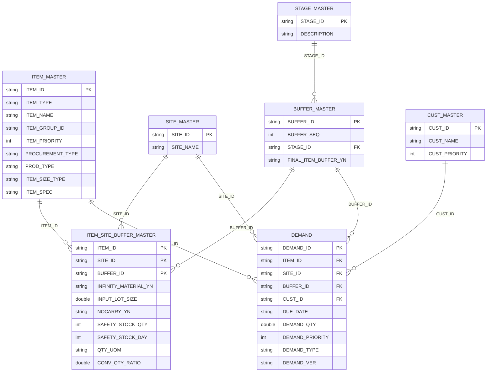
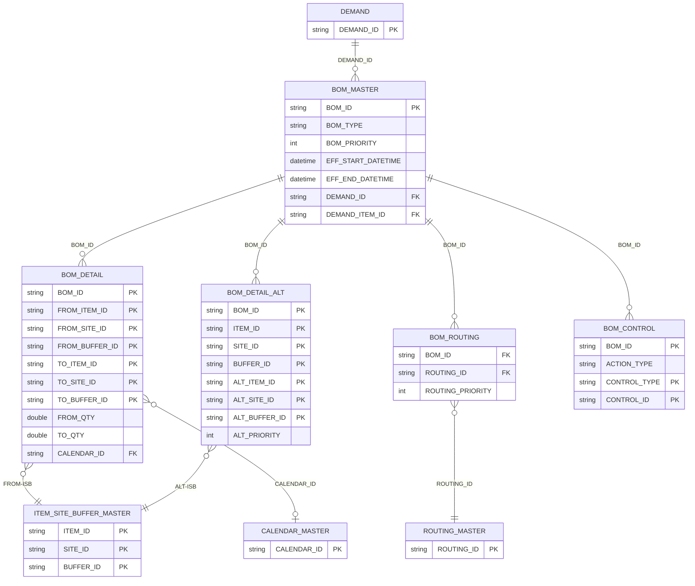
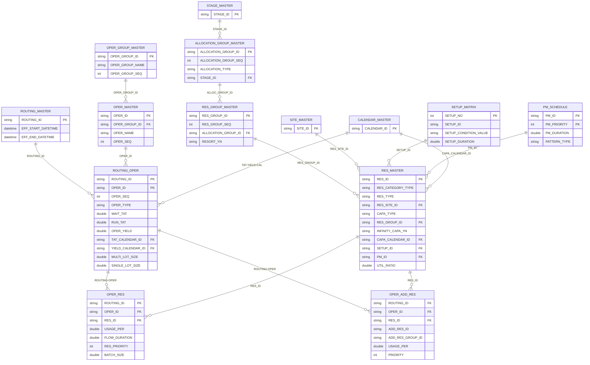
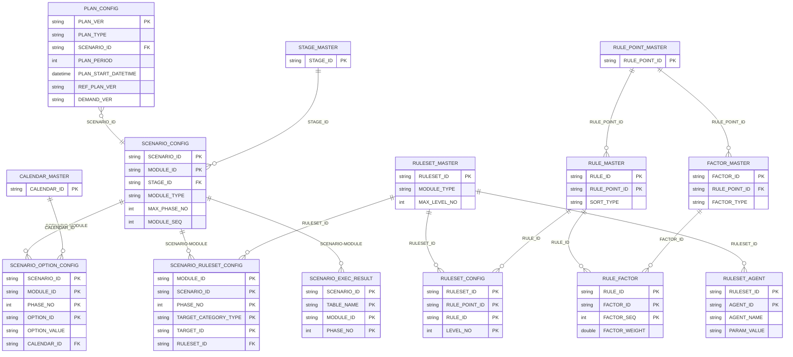
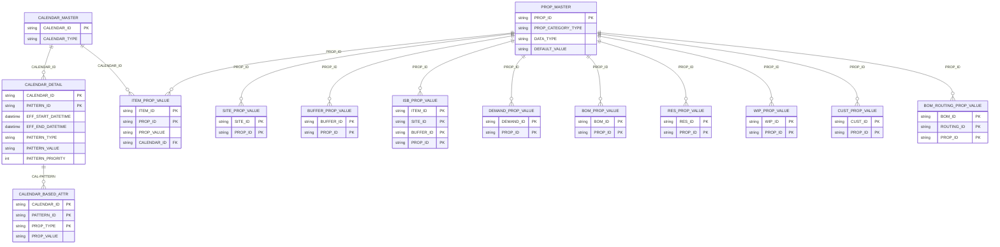
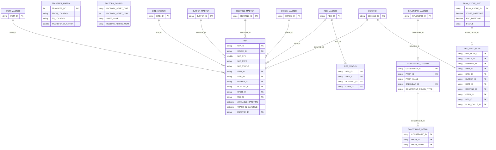
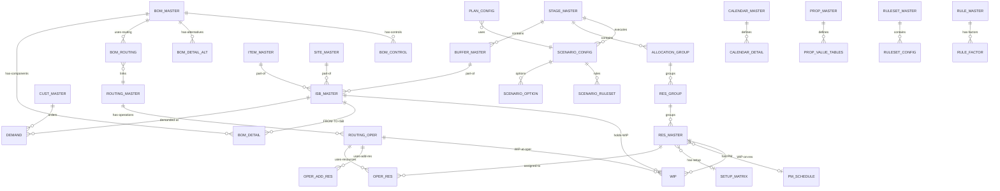

# 입력 테이블 ERD

> 의미적 컬럼 관계 기반 ERD (실제 FK 제약은 없으나 컬럼명으로 추론)

## 1. 핵심 마스터 관계도 (Core Master ERD)

## 2. BOM 구조 (BOM Structure ERD)

## 3. Routing - Resource 구조 (Routing and Resource ERD)

## 4. Scenario - Rule 구조 (Planning Config ERD)

## 5. Calendar - Property 구조 (Calendar and Property ERD)

## 6. WIP - 기타 (WIP and Misc ERD)

## 7. 전체 통합 개요 (Simplified Overview)

## 관계 요약표

| From Table | To Table | Key Column | 관계 유형 | 설명 |
|-----------|----------|-----------|----------|------|
| ITEM_MASTER | ISB_MASTER | ITEM_ID | 1:N | 품목은 여러 ISB에 등록 |
| SITE_MASTER | ISB_MASTER | SITE_ID | 1:N | 사이트에 여러 ISB |
| BUFFER_MASTER | ISB_MASTER | BUFFER_ID | 1:N | 버퍼에 여러 ISB |
| STAGE_MASTER | BUFFER_MASTER | STAGE_ID | 1:N | 스테이지에 여러 버퍼 |
| CUST_MASTER | DEMAND | CUST_ID | 1:N | 고객별 다수 주문 |
| ISB_MASTER | DEMAND | ITEM+SITE+BUFFER | 1:N | ISB별 다수 주문 |
| BOM_MASTER | BOM_DETAIL | BOM_ID | 1:N | BOM 헤더-상세 |
| BOM_DETAIL | ISB_MASTER | FROM/TO ISB | N:1 | 투입/산출 ISB 참조 |
| BOM_MASTER | BOM_ROUTING | BOM_ID | 1:N | BOM-Routing 매핑 |
| ROUTING_MASTER | BOM_ROUTING | ROUTING_ID | 1:N | Routing 참조 |
| ROUTING_MASTER | ROUTING_OPER | ROUTING_ID | 1:N | Routing-공정 |
| ROUTING_OPER | OPER_RES | ROUTING+OPER | 1:N | 공정-설비 매핑 |
| RES_MASTER | OPER_RES | RES_ID | 1:N | 설비 할당 |
| RES_GROUP_MASTER | RES_MASTER | RES_GROUP_ID | 1:N | 설비 그룹핑 |
| ALLOC_GROUP | RES_GROUP | ALLOCATION_GROUP_ID | 1:N | 할당 그룹 |
| RES_MASTER | SETUP | SETUP_ID | 1:N | 설비별 셋업 |
| RES_MASTER | PM | PM_ID | 1:N | 설비별 PM |
| CALENDAR_MASTER | CALENDAR_DETAIL | CALENDAR_ID | 1:N | 캘린더 상세 |
| PLAN_CONFIG | SCENARIO_CONFIG | SCENARIO_ID | N:1 | 계획-시나리오 |
| SCENARIO_CONFIG | SCENARIO_OPTION | SCENARIO+MODULE | 1:N | 시나리오 옵션 |
| RULESET_MASTER | RULESET_CONFIG | RULESET_ID | 1:N | 룰셋 구성 |
| RULE_MASTER | RULE_FACTOR | RULE_ID | 1:N | 규칙-팩터 |
| PROP_MASTER | *_PROP_VALUE | PROP_ID | 1:N | 속성 정의-값 |
| ISB/ROUTING/RES | WIP | 복합키 | 1:N | WIP 위치 참조 |
